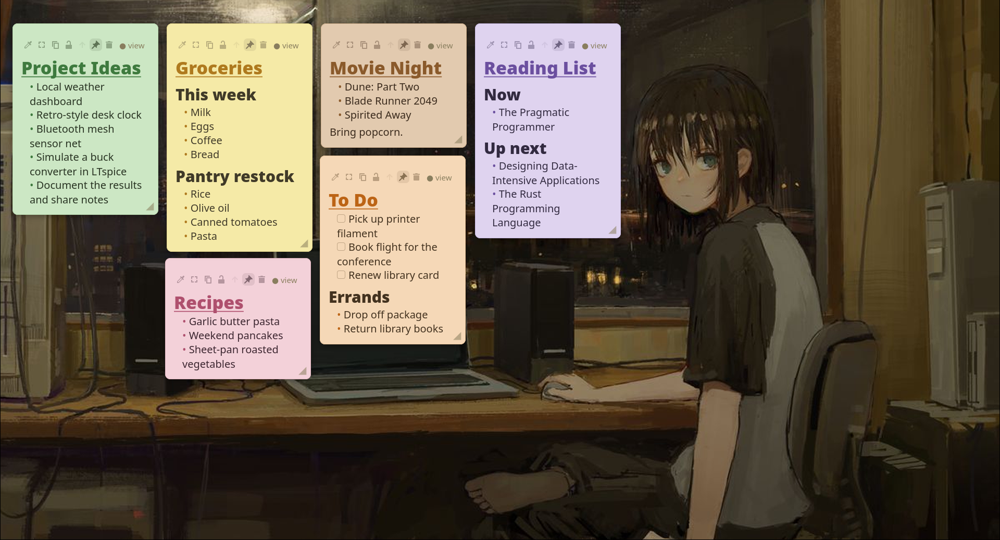

<p align="center">
  
</p>

<h1 align="center">Waynote</h1>

<p align="center"><strong>Wayland-native, markdown-based desktop sticky notes for Linux.</strong></p>

<p align="center">
  <a href="LICENSE"></a>
  <a href="https://www.rust-lang.org/"></a>
  <a href="https://wayland.freedesktop.org/"></a>
</p>

<p align="center">
  
</p>

Waynote keeps quick, glanceable notes on the desktop layer of your Wayland
compositor (`wlr-layer-shell`), instead of a floating window. Notes are plain
`.md` files — hackable, version-controllable, and friendly to Obsidian and AI
agents: edit a note from any editor and it refreshes live on screen, with
conflict copies instead of silent overwrites.

> [!IMPORTANT]
> **This is [IKGB105](https://github.com/IKGB105)'s personal fork** of
> [mryll/waynote](https://github.com/mryll/waynote), kept for my own daily use.
> It is not affiliated with, and does not track, the upstream project's issue
> tracker or releases — see [What's different in this fork](#whats-different-in-this-fork)
> below for the full list of changes, and file issues here, not upstream, for
> anything specific to this version. Everything in that list was built with
> AI pair-programming assistance (Claude Code).

> [!NOTE]
> **Young, but functional.** The full feature set works; the interactive paths
> (drag/resize, click-to-edit, checkboxes, image paste, tray) have had limited
> real-world testing, so expect the occasional rough edge.

## Compatibility

Waynote needs a compositor that implements `wlr-layer-shell`:

- ✅ **Supported:** Hyprland, Sway, river, Wayfire, niri, KDE/KWin, COSMIC.
- ❌ **Not supported:** GNOME/Mutter (no layer-shell), X11, macOS, Windows.

## Install

This fork isn't packaged anywhere — build it from source. (The upstream `waynote`
/ `waynote-bin` AUR packages are a different project; they don't include
anything from [What's different in this fork](#whats-different-in-this-fork).)

You'll need a `wlr-layer-shell` compositor (see
[Compatibility](#compatibility)), [Rust](https://www.rust-lang.org/tools/install)
(stable), and the GTK 4 + `gtk4-layer-shell` development libraries. On Arch:

```sh
sudo pacman -S gtk4 gtk4-layer-shell rust
```

Then build, and install the desktop entry, tray icon, and systemd unit into your
home directory:

```sh
git clone https://github.com/IKGB105/waynote-fork.git
cd waynote-fork
cargo build --release
./target/release/waynote install-user-assets   # desktop entry, tray icon, systemd unit
```

## Usage

### Running the app

```sh
waynote          # or, from a source checkout: cargo run
```

Loads notes from `$XDG_DATA_HOME/waynote/notes/` (typically
`~/.local/share/waynote/notes/`). Notes are plain `.md` files — drop any
conforming markdown file in that directory and it appears on the desktop within
seconds.

### Subcommands

```sh
waynote                             # run the app
waynote new [<monitor>]             # create a new note (optionally on a monitor, e.g. DP-2)
waynote show-all | hide-all | toggle  # show / hide all notes (forwards to the app)
waynote doctor                      # run diagnostics (D-Bus, SNI tray, paths)
waynote install-user-assets         # install icon, .desktop, and systemd unit
waynote autostart on|off|status     # toggle the systemd user autostart
waynote --render-demo               # open the markdown render demo window (dev)
```

### Window-manager keybinds

The CLI verbs forward to the already-running instance (starting it if needed), so
bind them in your compositor — the same idea on any `wlr-layer-shell` WM.

Hyprland (`~/.config/hypr/hyprland.conf`):

```ini
bind = SUPER, N, exec, waynote new
bind = SUPER SHIFT, H, exec, waynote hide-all
bind = SUPER SHIFT, S, exec, waynote show-all
bind = SUPER SHIFT, T, exec, waynote toggle      # hide all, or show all if any are hidden
```

Sway (`~/.config/sway/config`):

```
bindsym $mod+n exec waynote new
bindsym $mod+Shift+h exec waynote hide-all
bindsym $mod+Shift+s exec waynote show-all
bindsym $mod+Shift+t exec waynote toggle
```

> [!TIP]
> On Wayland an app can't know which monitor has focus, so a new note lands on the
> monitor under the pointer, else the last-used one, else the primary. To force the
> note onto the **focused** monitor, pass it explicitly — your compositor knows it:
>
> ```ini
> # Hyprland
> bind = SUPER, N, exec, waynote new "$(hyprctl activeworkspace -j | jq -r .monitor)"
> ```
> ```
> # Sway
> bindsym $mod+n exec waynote new "$(swaymsg -t get_workspaces | jq -r '.[]|select(.focused).output')"
> ```

Any other action — `arrange`, or per-note ones like `set-color`, `toggle-lock`,
`move-to-monitor` — is available over D-Bus:

```sh
gapplication action dev.mryll.waynote arrange
```

## What's different in this fork

Everything below was built on top of [mryll/waynote v0.1.3](https://github.com/mryll/waynote),
for my own daily-driver use:

- **No title bar.** The header strip is now just a thin, empty drag handle — no
  title text, no buttons in it. The whole action cluster (colour, fit,
  copy, lock, layer, pin, move-to-monitor, delete) moved into the note's own
  top row, next to the "● view" / "✓ save" mode pill. A note's title isn't a
  separate editable field any more — it's just the first `# ...` heading line
  in the body, edited through the same body editor as everything else.
- **Fit-to-content button** (⤢): resizes a note's height to exactly match its
  body at its current width — no more dragging the bottom-right corner and
  guessing.
- **Ten paper colours**, up from seven — added red, teal, and brown.
- **New notes auto-place and auto-colour.** A new note lands in the next open
  spot in the arrange flow (dodging existing notes on the same monitor,
  either layer) instead of a fixed diagonal cascade, and gets a colour picked
  from the full palette instead of always the configured default.
- **Arrange is size-preserving and follows a manual order.** The `arrange`
  action only repositions notes (it no longer resets every note back to the
  default size on every call) and lays them out in fixed 2×2 blocks —
  top-left, top-right, bottom-left, bottom-right, in order, before starting
  the next block to the right — instead of the old single top-to-bottom
  cascade. Each note carries a priority number driving that order,
  auto-assigned left-to-right the first time this ran (leftmost = 1); nudge it
  from then on with the ▲/▼ header buttons (swaps with the nearest
  lower/higher-numbered note on the same monitor+layer and immediately re-runs
  "Arrange" on that surface, same as minimizing/restoring a note does).
- **Global font-scale setting**, adjustable live from the tray menu
  ("Font size +" / "Font size −", 0.5×–3×) and persisted across restarts.
- **Minimize to a dock chip.** Shrink a note to a small coloured square parked
  in the bottom-left corner of its monitor, no title or button on it —
  hovering shows the note's title as a tooltip, right-click anywhere on the
  chip to restore it. Minimizing or restoring re-runs "Arrange" on the rest of
  that surface automatically, so the remaining notes always settle back into
  the clean order-based grid. Survives a restart — a minimized note comes back
  as a chip, not full-size.
- **Deliberate spacing.** Auto-placed notes (new notes, Arrange, restore, the
  dock strip) keep a small, consistent gap from each other and a wider margin
  from the screen edges, instead of sitting flush against either.
- **Optional header controls.** `show_lock_button`, `show_pin_button`, and
  `show_mode_indicator` (the "● view" / "✓ save" pill) in `config.toml` — hand-
  edit only, like `font_scale` — hide controls you don't use without removing
  the feature; all default to `true`.

## Status

Feature-complete for daily use: notes on the Wayland desktop with faithful
markdown rendering, persistence with live file-watching and conflict copies,
per-note colour / lock / layer / move-to-monitor controls, a system-tray item,
image paste, and autostart. This fork is used daily on Hyprland — other
`wlr-layer-shell` compositors should work (see [Compatibility](#compatibility))
but haven't been verified here.

## Documentation

- [Design](docs/specs/2026-06-24-waynote-design.md) — product behavior,
  persistence model, architecture, and scope
- [Repaint contract](docs/notes/repaint-contract.md) — the validated redraw and
  input-region sequence, and its caveats
